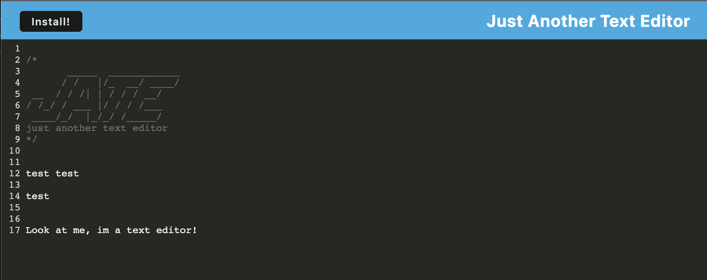

# G.O.A.T. Text Editor

## Introduction

Hey there everybody! Don't let the repo name fool you, this is no ordinary note taker, because its an awesome text editor! That's right, you can save your code snippets and revist them whenever you like. I know how it can be as an upandcoming web developer and the fact that there is just so much code to know! That is why GOAT was designed, to help you keep track of those code snippets you want to hold on to and revist when needed. Hope you enjoy!

## Installation

We made installation a breeze for you. All you have to do is click the Install button in the top left of the screen and add it as an extension. After that you will be able to use it as a standalone app!

## Link to deployed app

[Open G.O.A.T. Text Editor](https://goat-text-edit.herokuapp.com/)

## Screenshot

## Credits

Big thanks to John and Michael for helping debug an issue and another big shout out to Matt and Jake for helping debug a heroku issue. In the end we got it all figured out! Always the simplest thing!